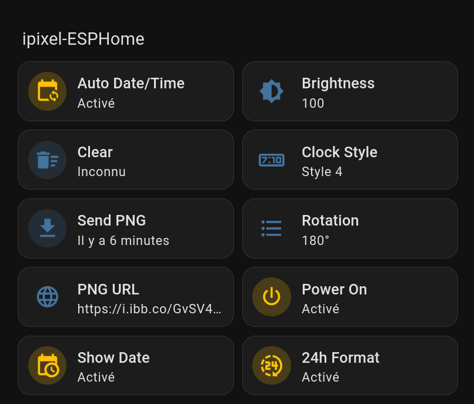

# iPixel-ESPHome

iPixel-ESPHome is an ESPHome integration to control an `iPixel Color` LED matrix via Bluetooth. This project allows connecting a compatible LED matrix to Home Assistant using an ESP32 as a Bluetooth gateway.



## Features

**This project is still in early development. Contributions are welcome!**

- Brightness control
- Clock display with different styles
- PNG image sending
- Screen orientation
- Screen on/off
- ROM clearing

## Prerequisites

- Python 3.x
- ESPHome (via ESPHome Builder or CLI)
- A compatible ESP32
- An iPixel LED matrix with Bluetooth connection

## Installation

1. Clone this repository or download the files.

2. Install Python dependencies:

   ```bash
   pip install ruamel.yaml watchdog
   ```

## Configuration

1. Create a `secrets.txt` file at the root of the project with the following content:

   ```txt
   MAC_ADDRESS = 02:00:00:00:00:01
   HOME_ASSISTANT_KEY = YmFzZTY0X2R1bW15X2tleQ==
   OTA_PASSWORD = dummy_ota_password
   AP_FALLBACK_PASSWORD = dummy_ap_fallback
   BOARD = esp32-devkitm-dummy
   WIFI_SSID = DummyNetwork
   WIFI_PASSWORD = DummyPassw0rd!
   ```

   - `MAC_ADDRESS`: Bluetooth address of the LED matrix.
   - `HOME_ASSISTANT_KEY`: Home Assistant API key (base64 encoded).
   - `OTA_PASSWORD`: Password for OTA updates.
   - `AP_FALLBACK_PASSWORD`: Password for the fallback access point.
   - `BOARD`: ESP32 board model (e.g., esp32-c3-devkitm-1).
   - `WIFI_SSID`: WiFi network name.
   - `WIFI_PASSWORD`: WiFi network password.

   Replace the default values with your own information.

> 💡 Tip: Before configuring, add a new device in ESPHome using the device setup to help obtain the required values.

## Building the Configuration

Run the build script to generate the ESPHome configuration file:

```bash
python3 build.py
```

This will merge all YAML files in `src/` and replace placeholders with secret values.

For automatic change watching:

```bash
python3 watch.py
```

This script will watch YAML files in `src/` and automatically rebuild the configuration on changes.

## Flashing to ESP32

1. Open ESPHome Builder.

2. Create an empty configuration and copy the content of the generated `bin/ipixel-esphome.yaml` file (or import the `yaml` file directly).

3. Compile and flash the firmware to the device.

   - The first compilation may take a while as it needs to download and prepare the toolchain.

4. After flashing, add the device to Home Assistant.

## Project Structure

- `build.py`: Script to merge YAML configurations and replace secrets.
- `watch.py`: Watch script for automatic rebuilding.
- `src/`: Source YAML configuration files.
  - `esphome.yaml`: Base ESPHome configuration.
  - `bluetooth.yaml`: Bluetooth configuration.
  - `network.yaml`: Network configuration.
  - `commands/`: Configurations for each command (brightness, clear, clock, etc.).
- `bin/`: Generated files (ipixel-esphome.yaml).
- `secrets.txt`: Secrets file (to be created).

## Development

To modify the configuration:

1. Edit files in `src/`.
2. Use `python3 build.py` to regenerate `bin/ipixel-esphome.yaml`.
3. Copy & Paste to ESPHome Builder and flash to the ESP32 again.

Placeholders like `{{BOARD}}` will be replaced with values from `secrets.txt`.

## Troubleshooting

- Ensure the Bluetooth MAC address is correct.
- Check WiFi connection and credentials.
- Check ESPHome logs for errors.

## Related project

- [iPixel-CLI](https://github.com/lucagoc/iPixel-CLI) Python original project
- [iPixel-CFW](https://github.com/lucagoc/iPixel-CFW) CFW experimentation

Check also these cool projects made by other developers:

- [iPixel-ESP32 (ToBiDi0410)](https://github.com/ToBiDi0410/iPixel-ESP32): ESP32 port of this project
- [iPixel-CLI-ESP32 (Cino2424)](https://github.com/Cino2424/iPixel-CLI-ESP32/tree/port-esp32): Another ESP32 port of this project
- [go-ipxl (yyewolf)](https://github.com/yyewolf/go-ipxl): Go library implementation

## License

This project is licensed under the MIT License.
